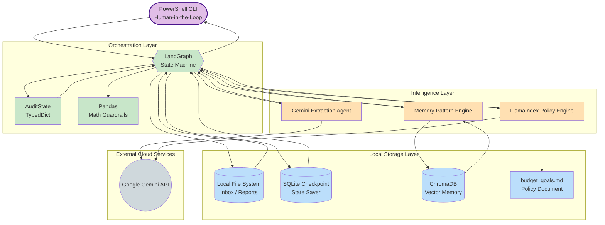
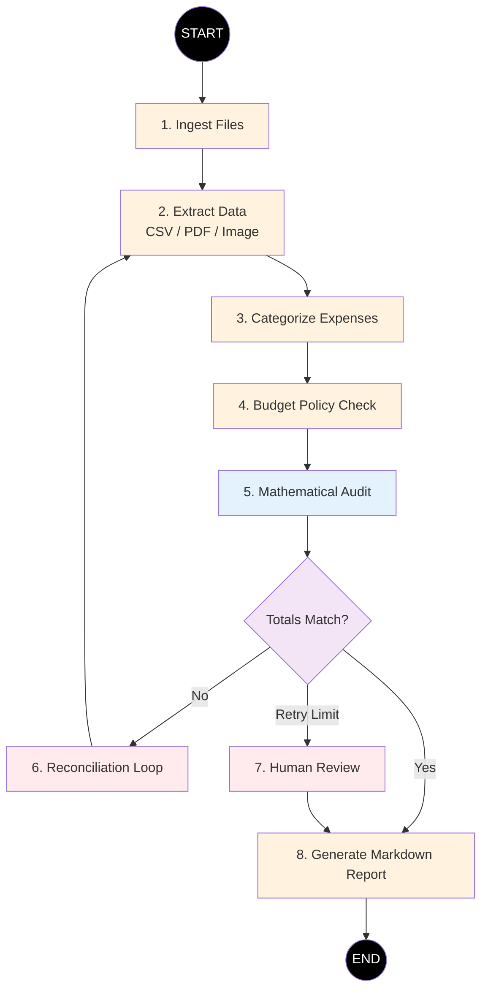

```mermaid
flowchart TB

%% ===== Nodes =====
CLI([PowerShell CLI<br/>Human-in-the-Loop])

subgraph Storage["Local Storage Layer"]
    FS[(Local File System<br/>Inbox / Reports)]
    SQL[(SQLite Checkpoint<br/>State Saver)]
    Chroma[(ChromaDB<br/>Vector Memory)]
    MD["budget_goals.md<br/>Policy Document"]
end

subgraph Core["Orchestration Layer"]
    LG{{LangGraph<br/>State Machine}}
    State["AuditState<br/>TypedDict"]
    Tools["Pandas<br/>Math Guardrails"]
end

subgraph Agents["Intelligence Layer"]
    Vision["Gemini Extraction Agent"]
    Memory["Memory Pattern Engine"]
    RAG["LlamaIndex Policy Engine"]
end

subgraph Cloud["External Cloud Services"]
    Gemini(("Google Gemini API"))
end

%% ===== Connections =====
CLI --> LG
LG --> CLI

FS --> LG
LG --> FS

LG --> SQL
SQL --> LG

LG --> State
State --> LG

LG --> Tools

LG --> Vision
Vision --> LG

LG --> Memory
Memory --> LG

LG --> RAG
RAG --> LG

Memory --> Chroma
Chroma --> Memory

RAG --> MD

Vision --> Gemini
RAG --> Gemini

%% ===== Colors =====
style CLI fill:#e1bee7,stroke:#4a148c,stroke-width:2px

style FS fill:#bbdefb
style SQL fill:#bbdefb
style Chroma fill:#bbdefb
style MD fill:#bbdefb

style LG fill:#c8e6c9
style State fill:#c8e6c9
style Tools fill:#c8e6c9

style Vision fill:#ffe0b2
style Memory fill:#ffe0b2
style RAG fill:#ffe0b2

style Gemini fill:#cfd8dc
```

```mermaid
flowchart TD

Start((START))

Ingest["1. Ingest Files"]

Extract["2. Extract Data<br/>CSV / PDF / Image"]

Categorize["3. Categorize Expenses"]

Policy["4. Budget Policy Check"]

Audit["5. Mathematical Audit"]

Decision{Totals Match?}

Retry["6. Reconciliation Loop"]

Human["7. Human Review"]

Report["8. Generate Markdown Report"]

End((END))

Start --> Ingest
Ingest --> Extract
Extract --> Categorize
Categorize --> Policy
Policy --> Audit
Audit --> Decision

Decision -- Yes --> Report

Decision -- No --> Retry

Retry --> Extract

Decision -- Retry Limit --> Human

Human --> Report

Report --> End

style Start fill:#000,color:#fff
style End fill:#000,color:#fff

style Ingest fill:#fff3e0
style Extract fill:#fff3e0
style Categorize fill:#fff3e0
style Policy fill:#fff3e0
style Report fill:#fff3e0

style Audit fill:#e3f2fd

style Decision fill:#f3e5f5

style Retry fill:#ffebee
style Human fill:#ffebee
```