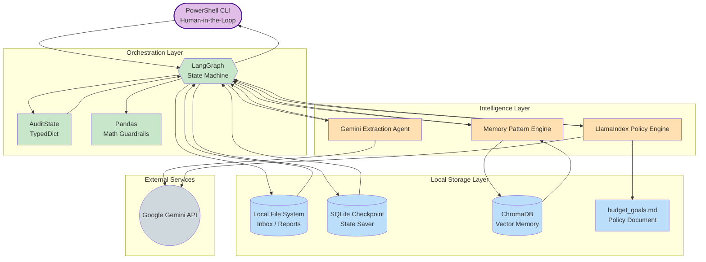
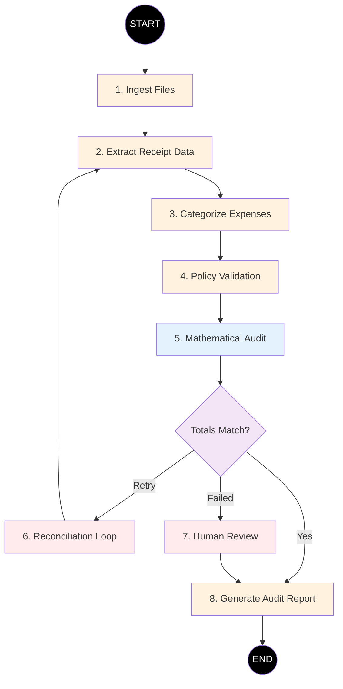

# 🧾 Local Ledger: Autonomous AI Budget Auditor

> An AI-powered local financial auditing system that automatically processes bank statements and receipt images, validates spending against custom budget rules, and generates mathematically verified audit reports.

Built with **LangGraph**, **Google Gemini Vision**, **LlamaIndex**, **ChromaDB**, **SQLite**, and **Pandas**.

---

# ✨ Features

- 📄 **Multi-Modal Data Ingestion**
  - Processes CSV bank statements, PDF receipts, and receipt images.
  - Uses Gemini Vision with structured Pydantic schemas for reliable extraction.

- 🤖 **Agentic Workflow**
  - Powered by LangGraph state machines.
  - Deterministic execution instead of a simple chatbot pipeline.

- 🔄 **Self-Correcting Audit Loop**
  - Automatically retries extraction when totals don't match.
  - Prevents incorrect financial reports.

- 👨‍💻 **Human-in-the-Loop**
  - Pauses execution when reconciliation fails.
  - Allows manual intervention before continuing.

- 🧠 **Long-Term Memory**
  - ChromaDB stores vendor embeddings.
  - Learns transaction categories over time.

- 📚 **Policy-Based Auditing**
  - Reads plain-English budget rules from a Markdown file.
  - Uses LlamaIndex RAG to detect spending violations.

- 🧮 **Deterministic Math**
  - Pandas performs all financial calculations.
  - Eliminates LLM math hallucinations.

---

# 🏗️ System Architecture



---

# 🔄 LangGraph Workflow



---

# ⚙️ Installation

## 1. Clone the Repository

```bash
git clone https://github.com/YOUR_USERNAME/LocalLedger.git
cd LocalLedger
```

---

## 2. Create a Virtual Environment

### Windows

```powershell
python -m venv venv
.\venv\Scripts\Activate.ps1
```

### macOS / Linux

```bash
python3 -m venv venv
source venv/bin/activate
```

---

## 3. Install Dependencies

```bash
pip install -r requirements.txt
```

---

## 4. Configure Environment Variables

Create a `.env` file in the project root.

```env
GEMINI_API_KEY=your_google_ai_studio_api_key
```

---

# 📁 Project Structure

```text
LocalLedger/
│
├── data/
│   ├── inbox/
│   ├── processed/
│   ├── reports/
│   └── chroma_db/
│
├── src/
│   ├── main.py
│   ├── graph.py
│   ├── state.py
│   ├── extractors.py
│   ├── memory.py
│   ├── policy.py
│   ├── tools.py
│   ├── schemas.py
│   └── file_handler.py
│
├── .env
├── requirements.txt
└── README.md
```

---

# 🚀 Usage

## Step 1 — Define Budget Rules

Edit:

```text
data/inbox/budget_goals.md
```

Example:

```text
Monthly Food Budget: ₹8000

Alert if Shopping exceeds ₹5000.

Notify if Entertainment exceeds ₹3000.

Flag any transaction above ₹10000.
```

---

## Step 2 — Add Financial Documents

Place the following inside:

```text
data/inbox/
```

Example:

```
bank_statement.csv
receipt1.jpg
receipt2.png
receipt3.pdf
budget_goals.md
```

---

## Step 3 — Run the Auditor

```bash
python src/main.py
```

---

## Step 4 — Review the Report

The generated audit will be available at:

```text
data/reports/latest_audit.md
```

---

# 🛠️ Tech Stack

| Category | Technology |
|-----------|------------|
| Language | Python |
| Agent Framework | LangGraph |
| Vision Model | Google Gemini 2.5 Flash |
| Retrieval | LlamaIndex |
| Vector Database | ChromaDB |
| Local Database | SQLite |
| Validation | Pydantic |
| Data Processing | Pandas |
| Fuzzy Matching | RapidFuzz |
| Environment | python-dotenv |

---

# 📌 Future Improvements

- Multi-bank statement support
- OCR confidence scoring
- Expense trend visualization
- Local LLM support via Ollama
- Email audit reports
- Interactive Streamlit dashboard
- Monthly spending analytics
- Recurring subscription detection

---

# 📄 License

This project is licensed under the **MIT License**.

---

# ⭐ If you found this project helpful, consider giving it a star!